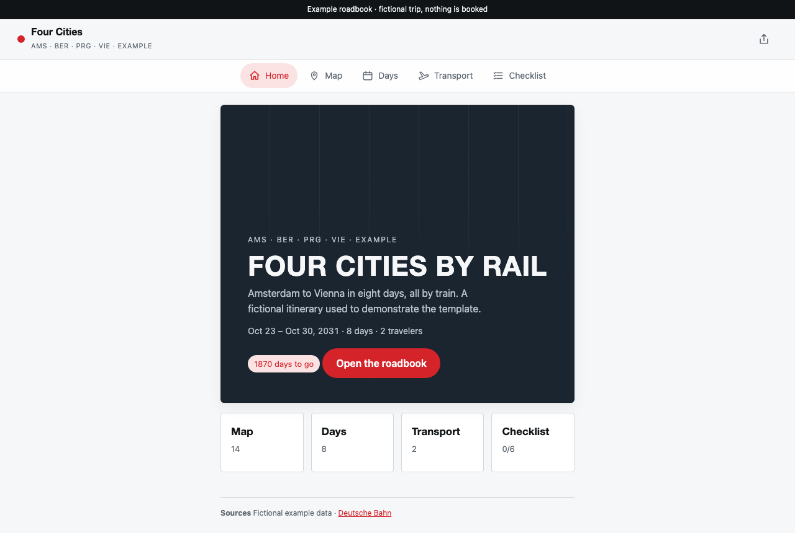
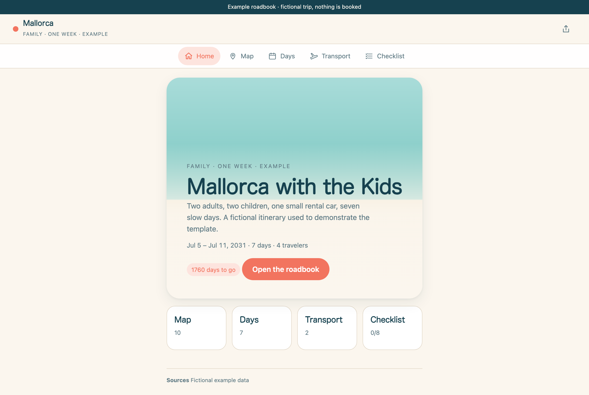
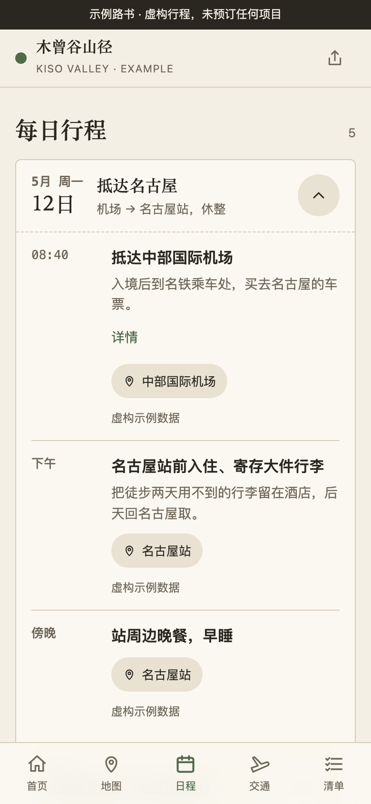
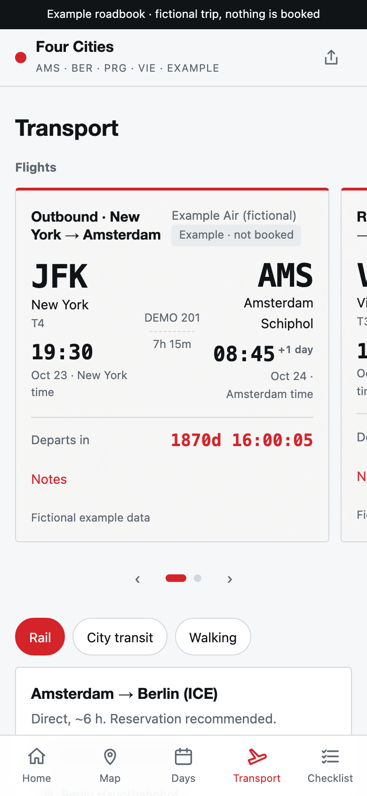
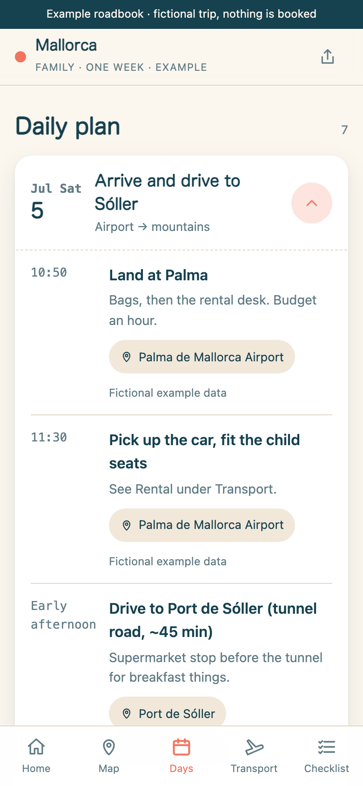

# travel.skill

**把旅行资料，变成有个人风格、可以分享的旅行网站。**

<p align="center"></p>

订单、截图、备忘、链接 → 一个旅途中在手机上打开、发给同行人的页面。在线示例：**https://clarkchenkai.github.io/travel.skill/**

- **模板**：无依赖静态网站（纯 HTML、CSS、JavaScript）：首页、地图、日程、交通、清单；三套视觉方向；手机与桌面排布；首次成功缓存后可离线阅读已缓存内容（在线地图仍需网络）；可打印成纸质路书；聊天应用里有分享卡片。
- **五项协作技能（Skills）**：覆盖旅行管理、产品制作、AI 设计、模板扩展与交付验证，供 Claude Code、Codex CLI 等编程代理（Coding Agent）使用：读资料、找缺口、填一份数据文件、预览、发布前检查。不编造事实。

不需要账号、数据库、付费服务。唯一要求是 Node.js 20+，示例不用任何 AI 就能跑。

[English →](README.md)

## 熊野古道 · 真实作品

[观看 45 秒真实操作短片](https://clarkchenkai.github.io/travel.skill/#work) · [打开完整路书](https://kumano-roadbook.pages.dev/?v=hd35)

纸面展示页采用细字、细线、苔绿色油墨与大面积留白；短片来自作者实际操作，展示开场、地图、日程与交通。熊野为定制作品，下方四个虚构示例展示轻量模板。


## 三种开始方式

**1. 在 GitHub 上用模板（什么都不用装）。** 点 *Use this template* → 建自己的仓库 → Settings → Pages → Source 选 *GitHub Actions*。启用 Pages 并成功运行自带工作流后，一份起步路书发布到 `https://<你>.github.io/<仓库>/`。之后在网页里或本地改 `trip/travel-data.json`，每次推送自动重新部署。

**2. 本地运行。**

```bash
git clone https://github.com/clarkchenkai/travel.skill && cd travel.skill
npm run new -- japan-hiking    # 把示例复制到 trip/
npm run dev                    # 打开 http://localhost:4173/
```

**3. 配合 Coding Agent。** 把资料放进 `input/`，在 Claude Code 或 Codex 里打开仓库，粘贴：

```text
用 travel skill 做我的旅行路书。
资料在 input/。目的地：<哪里>。日期：<起止>。同行：<几人>。
先读资料，填 trip/travel-data.json，然后跑缺口报告，把要问我的问题一次列出来。
不要编造时间、价格和预订状态。
```

回答缺口清单，看预览，提修改。准备好后 `npm run build && npm run check`，把 `dist/` 放到任何静态托管（[docs/PUBLISHING.md](docs/PUBLISHING.md)）。

可直接下载[完整仓库、Codex、Claude Code 或通用代理工作区](https://clarkchenkai.github.io/travel.skill/#downloads)。解压后从根目录打开，使用说明见 [AGENT-PACKS.md](docs/AGENT-PACKS.md)。

## 长什么样

仓库自带四个虚构示例，没有任何真实预订，只用来展示范围。

| `japan-hiking` · 主题 `field-notes` · 中文 | `europe-rail` · 主题 `timetable` · 英文 | `family-island` · 主题 `tide` · 英文 |
| --- | --- | --- |
|  |  |  |
|  |  |  |

另有 [business-trip](examples/business-trip/README.md)：五天伦敦商务差旅，含议程、按币种汇总的费用与凭证标记。这是独立页面模块，也示范如何生成新功能。

五天山谷徒步；八天跨四国的铁路环线（跨越欧洲夏令时结束）；一周带孩子的海岛自驾。气质不同，数据结构相同。所有照片均为为虚构行程生成的 AI 图像（GPT Image 2，经 Lovart），提示词与校验值见各示例的 `ASSETS.md` 和 [docs/VISUALS.md](docs/VISUALS.md)。

## 按旅行生成模板和功能

`npm run new -- --blank` 从空白事实开始；`npm run new -- --from <现有旅行>` 复用行程；`npm run template -- --trip trip` 生成可编辑模板。代理可以增加页面、功能模块和语言包，随后执行构建与浏览器验证。详见 [EXTENDING.md](docs/EXTENDING.md)。

## 目录

```
skills/         五项技能的唯一正文来源
.agents/skills/ Codex 发现入口；.claude/skills/ 为 Claude Code 入口
skill/          兼容入口与历史参考
evals/          行为场景、审阅方法与实际验证记录
template/       网站：index.html、styles.css、themes.css、app.js、core.mjs、i18n/
examples/       四个虚构行程
scripts/        new · dev · validate · gaps · build · check · preview · template · bundle · site · shot · check:offline（只用 Node，无依赖）
test/           node:test 测试（npm test）
docs/           数据字段、快速开始、发布、验证记录、视觉方法、演示录像
site/           示例画廊页（npm run site 构建，pages-demo.yml 部署）
showcase/       熊野古道 2026 真实路书完整版（本项目的来源，React + Three.js）
trip/           你的旅行（npm run new 生成）
input/          你的原始资料（不入 Git）
```

## 测了什么，测到哪一层

`npm test` 覆盖时区、租车取还联动、数据与隐私校验、动态模板、模块、下载包及离线缓存隔离。四个示例已做手机、平板、桌面宽度的浏览器检查；展示站已有实际部署记录。新增页面与新语言还通过独立代理生成和浏览器操作验证。物理手机完整触摸验收及陌生用户采用仍未完成。详见 [VERIFICATION.md](docs/VERIFICATION.md)。

这个项目第一阶段的目标只有一句：**10 个陌生人不找作者指导，也能完成自己的第一份路书。** 你试过之后，请用「first roadbook」Issue 模板告诉我们过程，尤其是卡在哪里。

## 隐私

发布后 `dist/travel-data.json` 任何拿到链接的人都能下载。校验器和发布审计会拦下订单号、证件号类字段、令牌和本机路径，但读不懂你的自由文本。发布前自己把数据文件读一遍。`input/` 里的原件永远不会被复制进构建产物。

## 贡献

主题、国家/地区适配、模块、测试用例是四条贡献路线，见 [CONTRIBUTING.md](CONTRIBUTING.md)。Issue 模板覆盖首次路书反馈、Bug、主题提案和国家适配。

## 来源与许可

模板脱胎于一次真实旅行的自托管路书：完整网站、数据与设计记录在 [showcase/kumano-kodo](showcase/kumano-kodo/README.md)，其虚构数据版本此前发布为 [kumano-roadbook-template](https://github.com/clarkchenkai/kumano-roadbook-template)。本仓库将它重写为无依赖、不绑定国别视觉的模板，移植了它的动效层，并补上由那次开发笔记精简而成的代理 Skill。

MIT，见 [LICENSE](LICENSE)。示例数据为虚构；地名为公开地标，只用于展示地图功能。
